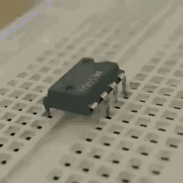
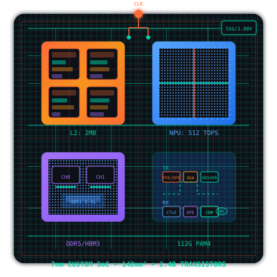
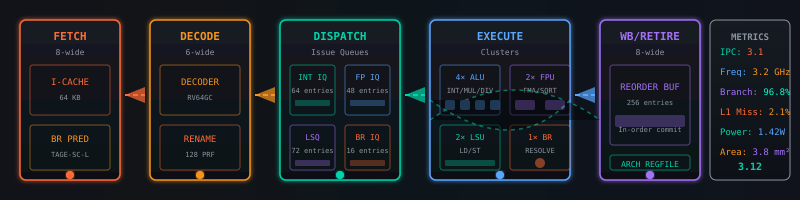

<div align="center">



# 🔬 Razor_C / Mister Negative

### VLSI · Embedded Systems · Rust · Linux

**Custom chip design · RTL to GDSII · Microcontrollers & sensors · RISC-V / FPGA**

<p>
  
  
  
</p>

<a href="https://rajarshimondal.pages.dev"></a>
<a href="https://www.linkedin.com/in/rajarshi-mondal-5b70a9228/"></a>
<a href="https://t.me/BURNINGFIREBLAZE"></a>

</div>

## 👤 About me

```yaml
nickname: Razor_C / Mister Negative
location: India
current_focus: Custom VLSI chip design
learning: VLSI design and Rust
collaborating_on: Embedded systems and sensor projects
os: Arch Linux
hobbies: Gaming, Linux customization, cloud solutions
```

## 🛠️ What I work on

- **Custom VLSI / digital hardware design** — RTL coding, synthesis, place & route, up to silicon sign-off
- **Embedded systems** — microcontrollers, sensors, firmware, and hardware bring-up
- **RISC-V development & FPGA projects** — architecture exploration and prototyping
- **Systems programming with Rust** — performance-focused, memory-safe tooling
- **Web applications** — Next.js, Django, Flutter

## 🧰 Tech stack

<p>
  
</p>

**Hardware:** Verilog · VHDL · SystemVerilog · VLSI · RISC-V · FPGA · Microcontrollers  
**Tools:** Arch Linux · Docker · Git · Postman · Firebase

## 🔬 Silicon visualizations

*A look at the kind of design space I work in.*

<div align="center">





</div>

## 📊 GitHub analytics

<div align="center">
  
  
</div>

<div align="center">
  
</div>

## 🐍 Contribution snake

<!-- Generated by .github/workflows/snake.yml -->
<picture>
  <source media="(prefers-color-scheme: dark)" srcset="https://raw.githubusercontent.com/MISTERNEGATIVE21/MISTERNEGATIVE21/output/github-contribution-grid-snake-dark.svg" />
  <source media="(prefers-color-scheme: light)" srcset="https://raw.githubusercontent.com/MISTERNEGATIVE21/MISTERNEGATIVE21/output/github-contribution-grid-snake.svg" />
  
</picture>

## 🤝 Open to collaborate

Embedded systems · Sensor projects · RISC-V · Custom chip design

<div align="center">

> ⚡ BTW I USE ARCH 🐧

</div>

---

<div align="center">
  Thanks for visiting! ⭐
</div>