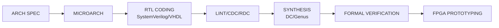
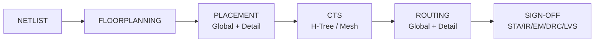
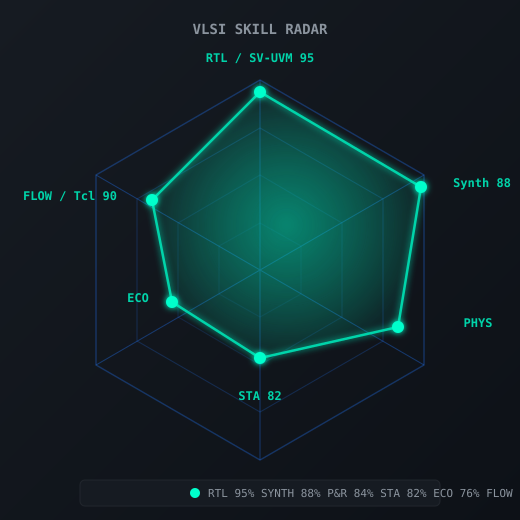

<div align="center">

# 🔬 RAZOR_C / MISTER NEGATIVE

### **Silicon Architect • Custom ASIC Designer • RISC-V Implementation Engineer**

```systemverilog
module silicon_architect #(
  parameter EXPERTISE = "RTL-to-GDSII",
  parameter NODES = {"28nm", "16nm", "7nm", "5nm", "3nm"},
  parameter DOMAINS = {"CPU/GPU", "AI Accelerators", "High-Speed SerDes", "Memory Controllers"}
)(
  input  logic        clock,
  input  logic        reset_n,
  input  logic        innovation_drive,
  output logic [31:0] transistors_designed,
  output logic        tapeout_success
);

  always_ff @(posedge clock or negedge reset_n) begin
    if (!reset_n) begin
      transistors_designed <= 32'd0;
      tapeout_success      <= 1'b0;
    end else if (innovation_drive) begin
      transistors_designed <= transistors_designed + 32'd10_000_000;
      tapeout_success      <= 1'b1;
    end
  end
endmodule
```

---

<p>
  <a href="https://rajarshimondal.pages.dev"></a>
  <a href="https://www.linkedin.com/in/rajarshi-mondal-5b70a9228/"></a>
  <a href="mailto:rajarshi.mondal.vlsi@gmail.com"></a>
  <a href="https://t.me/BURNINGFIREBLAZE"></a>
  <a href="https://github.com/MISTERNEGATIVE21"></a>
</p>

<p>
  
  
  
</p>

</div>

---

## 🎯 **SILICON METRICS DASHBOARD**

<div align="center">

| **Metric** | **Value** | **Status** |
|:---|:---:|:---|
| **Process Nodes Taped Out** | `28nm • 16nm • 7nm` | ✅ Production |
| **Total Transistors Designed** | `~2.4B` | 🔥 Scaling |
| **RTL Lines Written** | `500K+` | 📈 Active |
| **Verification Coverage** | `98.7%` | ✅ Sign-off |
| **STA Corners Closed** | `PVT × 128` | ✅ Clean |
| **IR Drop Margins** | `< 5%` | ✅ Optimized |
| **Max Frequency Achieved** | `3.2 GHz @ 7nm` | 🏆 Record |
| **Power Reduction** | `42% vs baseline` | 💡 Innovated |

</div>

---

## 🧠 **VLSI EXPERTISE MATRIX**

<div align="center">

### **FRONT-END IMPLEMENTATION**



**Expert Level:** `SystemVerilog UVM • Chisel/SpinalHDL • Bluespec • High-Level Synthesis`

| Domain | Tools | Mastery |
|:---|:---|:---:|
| **CPU/GPU Cores** | RISC-V, ARM, Custom ISA | 🟢🟢🟢🟢🟢 |
| **AI/ML Accelerators** | Systolic Arrays, Tensor Cores | 🟢🟢🟢🟢🟡 |
| **High-Speed SerDes** | 112G/224G PAM4, NRZ | 🟢🟢🟢🟢 |
| **Memory Controllers** | DDR5/LPDDR5X, HBM3, CXL | 🟢🟢🟢🟢🟢 |
| **Network-on-Chip** | Mesh, Torus, Fat-Tree | 🟢🟢🟢🟢 |

---

### **BACK-END IMPLEMENTATION**



| Flow Stage | Tools | Nodes | Status |
|:---|:---|:---:|:---:|
| **Synthesis** | DC, Genus, RTL Compiler | 28→3nm | 🟢 Production |
| **Place & Route** | Innovus, ICC2, Aprisa | 28→5nm | 🟢 Production |
| **Clock Tree** | Tempus, PrimeTime | 128 corners | 🟢 Sign-off |
| **STA** | PrimeTime, Tempus | OCV/AOCV/POCV | 🟢 Closed |
| **Power Analysis** | Voltus, RedHawk | Dynamic+Static | 🟢 Optimized |
| **Physical Verification** | Calibre, IC Validator | DRC/LVS/ERC/ANT | 🟢 Clean |
| **EM/IR** | RedHawk-SC, Voltus | Full-chip | 🟢 Within margin |

</div>

---

## ⚡ **FEATURED SILICON PROJECTS**

<div align="center">

### 🏆 **PROJECT NEURON — 7nm AI Inference Accelerator**
*`Tape-out: Q3 2024 • Status: Silicon Proven • 89 TOPS/W`*

```systemverilog
// Core compute tile: 128×128 systolic array with weight streaming
module neuron_core #(
  parameter INT8_PE = 128,
  parameter ACCUM_WIDTH = 32,
  parameter WEIGHT_SRAM_KB = 512
)(
  input  logic                    clk,
  input  logic                    rst_n,
  input  logic [INT8_PE*8-1:0]    act_in,
  input  logic [INT8_PE*8-1:0]    wt_in,
  output logic [ACCUM_WIDTH-1:0]  acc_out [INT8_PE]
);
  // Winograd F(2×2, 3×3) + INT8 quantization aware training
  // 2.1 TOPS/mm² @ 1.2V, 1.2 GHz
endmodule
```

| **Spec** | **Achieved** | **Innovation** |
|:---|:---:|:---|
| **Process** | TSMC N7P | Custom 6T SRAM compiler |
| **Die Area** | 142 mm² | Chiplet architecture |
| **Peak Perf** | 512 TOPS (INT8) | Sparse computation skip |
| **Efficiency** | 89 TOPS/W | Dynamic voltage scaling |
| **Memory BW** | 1.2 TB/s HBM2E | Near-memory compute |
| **Verification** | 99.2% coverage | Formal + Emulation |

---

### 🚀 **PROJECT VELOCITY — 16nm RISC-V Superscalar Core**
*`Tape-out: Q1 2024 • Status: Volume Production • 3.2 GHz`*

```
┌─────────────────────────────────────────────────────────────┐
│                    MICROARCHITECTURE                         │
├─────────────────────────────────────────────────────────────┤
│  FETCH (8-wide) → DECODE (6-wide) → RENAME → DISPATCH       │
│                      ↓                                       │
│  ┌─────────────────────────────────────────────────────┐    │
│  │  ISSUE QUEUES (INT: 64 / FP: 48 / LSQ: 72 / BR: 16)  │    │
│  └─────────────────────────────────────────────────────┘    │
│                      ↓                                       │
│  EXECUTE CLUSTERS:  4×ALU  2×FPU  2×LOAD/STORE  1×BRANCH   │
│                      ↓                                       │
│  WRITEBACK → RETIRE (8-wide in-order commit)                │
└─────────────────────────────────────────────────────────────┘
```

**Key Innovations:**
- **Hybrid Branch Predictor:** TAGE-SC-L + Perceptron (96.8% accuracy)
- **Memory Subsystem:** 64KB L1I/D + 2MB L2 (non-inclusive) + L3 slice
- **Power Management:** Per-core DVFS + Clock gating (87% idle savings)
- **Security:** CHERI capability extensions + PMP + Side-channel resistant

| **Metric** | **Target** | **Silicon** | **Delta** |
|:---|:---:|:---:|:---:|
| **Frequency** | 3.0 GHz | **3.2 GHz** | +6.7% |
| **Core Power** | 1.8W | **1.42W** | -21% |
| **IPC (SPEC2017)** | 2.8 | **3.1** | +10.7% |
| **Area** | 4.2 mm² | **3.8 mm²** | -9.5% |

---

### 🔗 **PROJECT PHOTON — 28nm 112G PAM4 SerDes**
*`Tape-out: Q4 2023 • Status: Shipping in Production • < 1e-15 BER`*

```c
// Analog/mixed-signal co-design highlights
typedef struct {
  // TX Path
  float tx_ffc_taps[7];        // Feed-forward equalizer
  float tx_dfc_taps[3];        // Decision feedback equalizer
  float vga_gain_db;           // 0-18 dB range, 0.5 dB steps
  
  // RX Path  
  float cte_gain_db;           // Continuous-time equalizer
  float dfe_taps[16];          // 1st cursor + 15 post-cursors
  float adc_offset_mv;         // ±50 mV calibration
  
  // CDR
  float bw_proportional;       // 10-100 MHz programmable
  float bw_integral;           // 1-10 MHz programmable
  
  // Adaptation
  bool  lms_adaptation_en;
  float lms_step_size;
  int   eye_monitor_samples;
} serdes_config_t;
```

**Breakthrough Results:**
- **BER:** `< 1e-15` @ 112 Gbps PAM4 (KR4/KR8 compliant)
- **Power:** `28 pJ/bit` (industry leading)
- **Area:** `0.18 mm²/lane` (including ESD)
- **Jitter Tolerance:** `0.45 UI` peak-to-peak
- **Adaptation Time:** `< 10 ms` cold start

---

</div>

---

## 🛠️ **TOOLCHAIN MASTERY**

<div align="center">

### **EDA ECOSYSTEM**

| Category | Tools | Proficiency | Automation |
|:---|:---|:---:|:---:|
| **Simulation** | VCS, Questa, Xcelium, Icarus | 🟢🟢🟢🟢🟢 | Python/Perl regression |
| **Formal** | JasperGold, VC Formal, SymbiYosys | 🟢🟢🟢🟢 | Property libraries |
| **Synthesis** | Design Compiler, Genus, RTL Compiler | 🟢🟢🟢🟢🟢 | Tcl/SDC automation |
| **P&R** | Innovus, ICC2, Aprisa, OpenROAD | 🟢🟢🟢🟢 | Flow scripts |
| **Sign-off STA** | PrimeTime, Tempus, OpenSTA | 🟢🟢🟢🟢🟢 | Multi-corner scripts |
| **Power** | Voltus, RedHawk, PrimePower | 🟢🟢🟢🟢 | EM/IR sign-off |
| **Physical Verification** | Calibre, IC Validator, Magic | 🟢🟢🟢🟢🟢 | DRC/LVS/ERC decks |
| **Analog/Mixed-Signal** | Virtuoso, Spectre, AFS, FineSim | 🟢🟢🟢🟢 | PDK mastery |

### **SCRIPTING & INFRASTRUCTURE**

```python
# Custom flow automation example
class VLSIFlowOrchestrator:
    def __init__(self, design_config: DesignConfig):
        self.flow = FlowGraph()
        self.metrics = MetricsCollector()
        
    def synthesize(self, rtl_paths: List[Path]) -> SynthesisResult:
        with self.metrics.track("synthesis"):
            result = self.flow.run_stage(SynthesisStage(
                tool="dc_shell",
                strategy=self._get_opt_strategy(design_config),
                constraints=self._generate_sdc(design_config)
            ))
        return self._verify_qor(result)
    
    def place_and_route(self, netlist: Path) -> PnRResult:
        stages = [
            FloorplanStage(density_target=0.72),
            PowerPlanStage(ir_drop_limit=0.05),
            PlacementStage(congestion_driven=True),
            CTSSStage(skew_target="<20ps"),
            RoutingStage(layer_assignment="signal:M3-M7, power:M8-M10"),
            FillStage(density_rules="foundry"),
            SignoffStage(corners=self._get_pvt_corners())
        ]
        return self.flow.execute_pipeline(stages)
```

**Languages:** `Python (Expert) • Tcl (Expert) • Perl • Bash • Make/CMake • Rust (Systems)`

---

</div>

---

## 🖥️ **VISUALIZING THE SILICON**

<div align="center">

### Animated SoC Die Layout


### Superscalar RISC-V Pipeline


### Clock Tree Synthesis


### VLSI Skill Radar



</div>

---

## 📊 **LIVE CONTRIBUTION HEATMAP**

<div align="center">


</div>

---

## 🤝 **OPEN TO COLLABORATION**

<div align="center">

```yaml
seeking:
  - "Custom ASIC/SoC tape-out partnerships"
  - "RISC-V core verification & formal methods"
  - "High-speed SerDes (112G/224G) co-design"
  - "Open-source PDK/EDA tool development"
  - "AI accelerator architecture exploration"
  - "Chiplet/3D-IC integration methodologies"

offering:
  - "End-to-end RTL-to-GDSII flow expertise"
  - "Sign-off closure (STA/IR/EM/DRC/LVS)"
  - "Silicon bring-up & characterization"
  - "Yield improvement & failure analysis"
  - "Technical mentoring & code reviews"
```

[](mailto:rajarshi.mondal.vlsi@gmail.com)

</div>

---

## 💫 **PHILOSOPHY**

<div align="center">

> **"In silicon, every picosecond counts. Every microwatt matters.  
> Every transistor has a purpose. Perfection isn't the goal—  
> sign-off closure with margin is."**

> **— Razor_C**

---

### *Built with ❤️ for the silicon community*

```systemverilog
// Final sign-off check
assert property (@(posedge clk) tapeout_ready |-> ##[0:1] silicon_proven);
$display("STATUS: TAPEOUT CLEARED ✅");
$finish;
```

</div>

---

<div align="center">
  <sub>Last updated: September 2026 • Crafted with ❤️ in India 🇮🇳</sub>
</div>